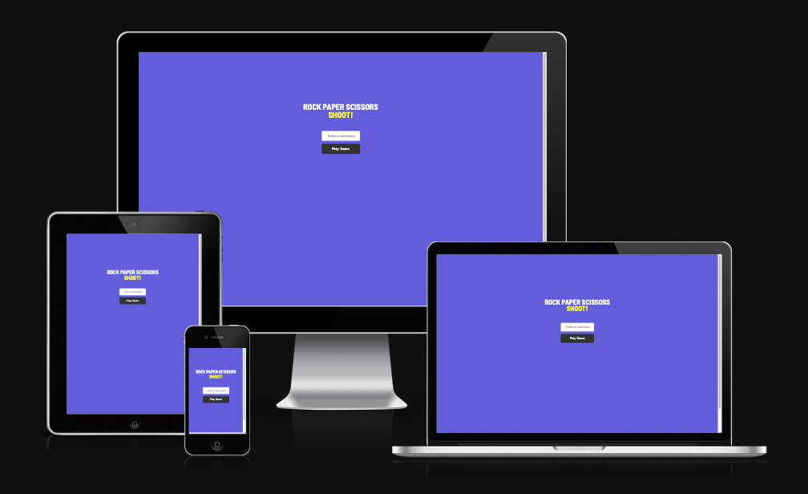
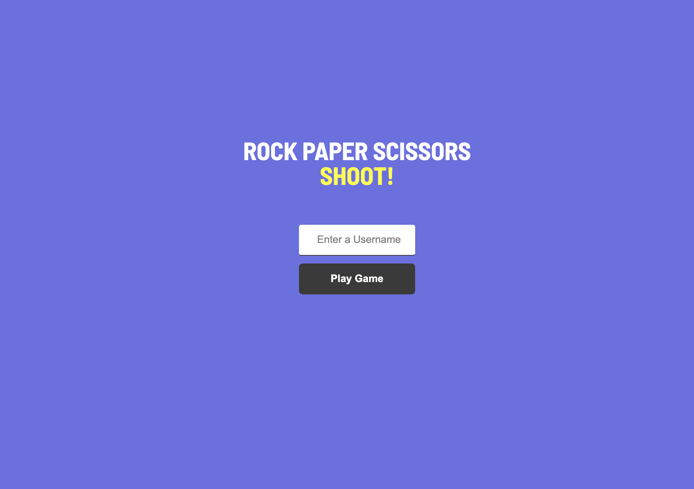
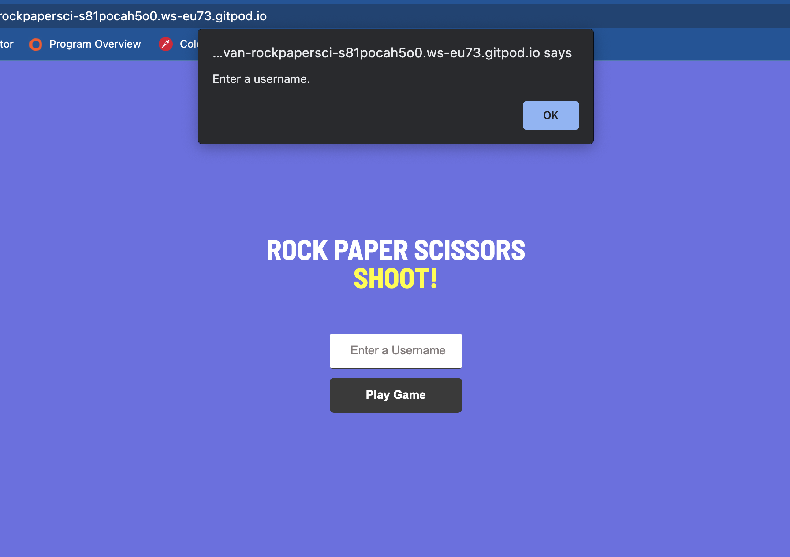
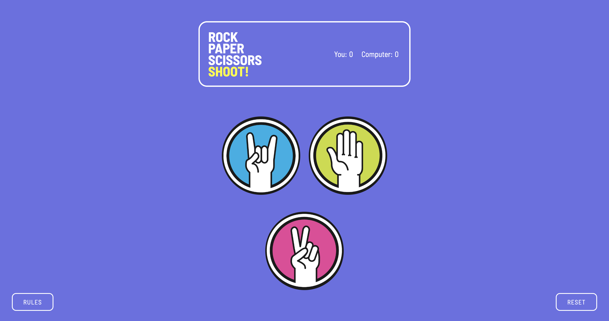
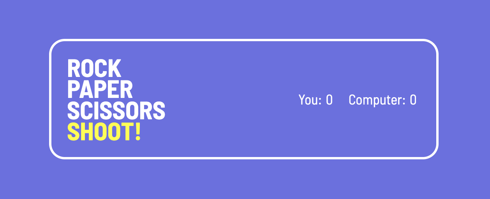
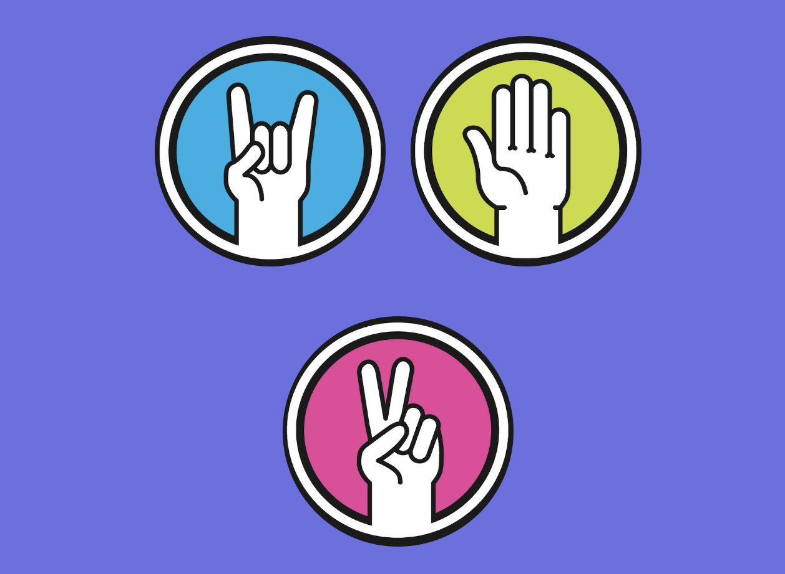
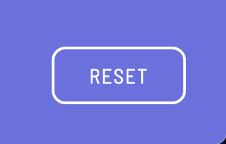

# Rock Paper Scissors Shoot!

Rock Paper Scissors Shoot!, is a site that was created to host a simple game of rock apaper scissors. The site main function to be used to have some fun and test yourself against the computer. The winner is the first to 5 points.

#### - __User Goals:__

- Visually appealing.
- Easy to navigate the app.
- To present simple game of rock paper scissors.

#### - __User Stories:__

- As a user I, want to play agame of RPS with no issues.
- As a user I, want to be able to seamlessly navigate the site. 
- As a user I, want to be able to view the webiste on any device and have user friendly navigation.

#### - __Site Owner Goals:__

- Promoate a game of rock paper scissors.
- Hopefully bring some enjoyment to the user. 

# Features 

### Existing Features

#### - __Login Page:__

  - A landing page with the title of site and a login form where the user must put in any username of their choice to be able to move onto the game. 

#### - __Login Page Input:__

  - You must submit a username to be able to play the game otherwise you'll be prompted with a message asking you to enter a username.

#### - __Main Screen:__

  - This is the main page of the website with all the features present.

#### - __The Header Section:__ 

  - The scoreboard keeps track of score between you and the computer.
  - This is also where the page title is stored.

#### - __Rock, Paper, Scissors Game Section:__

  - These are the icons you use to interact and play the game.
  - After you click these buttons you get an alert where you get told if you won/draw/lose that particular hand.
  - Once a player gets 5 points the game will push an alert saying who won the game and reset the scoreboard to 0.

#### - __Buttons:__

  - There are two buttons in the bottom corners:
    1. Rules which promts an alert displaying the game rules.
    2. Reset button which resets the scoreboard to 0-0.

 

### Features Left to Implement

- Noise sound affects based on if you win/lose a hand.

# Testing 

I feel that the site has hit the goals required by all parties. The site responds nicely to all different screen sizes, the images/icons look clean and sharp on all device sizes. Easy navigation. All links work on the site also. I didn't come across any issues with the site.
 
#### - __Validator Testing__

- HTML - No errors on any of my pages html when passing through the official [(W3C) validator](https://validator.w3.org/#validate_by_input)

- CSS - No errors were found when passing through the official [(Jigsaw) validator](https://jigsaw.w3.org/css-validator/#validate_by_input)

- Javascript - No errors were found when passing through the official [(Jshint) validator](https://jshint.com/)

#### - __Unfixed Bugs__

I haven't come across any unfixed bugs to make note of. 

# Deployment 

The live link can be found here - https://conorbevan.github.io/Rock-Paper-Scissors/

- The site was deployed to GitHub pages. The steps to deploy are as follows: 
- In the GitHub repository, navigate to the Settings tab.
- From the source section drop-down menu, select the main branch.
- Once the main branch has been selected, the page will be automatically refreshed with a detailed ribbon display to indicate the successful deployment.  

# Credits 

#### - __For Code Inspiration:__
- To help with creating my login submission form https://medium.com/swlh/how-to-create-your-first-login-page-with-html-css-and-javascript-602dd71144f1

#### - __For Content and Design Inspiration:__
- The font style I imported was from https://fonts.google.com/ 
- Game icons came from https://www.vecteezy.com/vector-art/691500-rock-paper-scissors-vector-icons